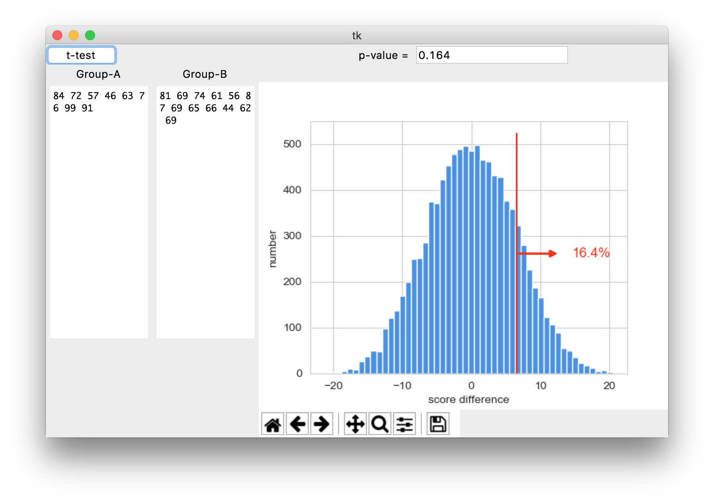

# a4-hackers_t-test_gui
Based on an existing Python script, create a graphical user interface to compute a hacker's t-test.

Author: Ryan Baker

# Problem statement
We would like to compute whether measurements of two groups are different. As an example, we could ask if students that had prior Python experience did better in this course (Group A), than students that are new to Python (Group B). We could use final grade as the measurement and ask *Does the observed difference in mean final grade lie within normal chance variation?* The computation needed is called a [t-test](https://en.wikipedia.org/wiki/Student's_t-test).

While there are formulae and a process to carry out a student t-test, the goal of this assignment to implement a hacker's version as presented in this video [Jake Vanderplas - Statistics for Hackers - PyCon 2016](https://www.youtube.com/watch?v=Iq9DzN6mvYA) (start at ~8min). A github user prepared a [Jupyter notebook](https://github.com/croach/statistics-for-hackers/blob/master/statistics-for-hackers.ipynb) with Python code for what is presented. The relevant code is available in `a4-hackers_t-test.py` with Sneetches data in `sneetches.txt`.

As explained in the video, the hacker's t-test assumes that measurements of Group A and Group B come from the same parent group, i.e. are the same. All measurements are pooled, then, repeatably, measurements are randomly assigned to Group A and Group B. The difference in means between the groups is calculated and stored. The percentage of simulated group differences larger than the original group difference indicates the significance value (p-value). The smaller the p-value, the higher the chances that Group A and Group B are different. A small p-value would warrant further investigation.

You will build a graphical user interface with Python and tkinter that:
1. Uses the object-oriented pattern and grid geometry manager.
2. Provides two text fields, one labeled *Group A*, the other *Group B*, to enter measurements for the two groups.
3. Contains a button to start the simulation with **10'000** iterations, and displaying the resulting p-value in a copy-paste'able widget.
4. Includes a Matplotlib plotting canvas to display the simulated histogram along with measured difference and p-value.
5. Alerts the user with a pop-up message about errors in data conversion when reading values from the text fields.
6. Test your GUI with the Sneetches data available in `sneetches.txt`. 

Optionally, you might consider including:
- Adding a widget to select the number of iterations.
- Add widgets and logic to compare simulation to `statsmodel.t_test`.
- Add a progressbar indicating simulation progress.
- Move the simulation into a thread in order for the GUI not to block.
- Extend the t-test from handling only 'larger' to handling 'larger', 'smaller' and 'two-sided' alternatives.

# What to do
Watch the video [Jake Vanderplas - Statistics for Hackers - PyCon 2016](https://www.youtube.com/watch?v=Iq9DzN6mvYA) (start at ~8min). Study the code in `a4-hackers_t-test.py`.

Design and implement a graphical user interface with the mandatory elements 1. - 6. outlined above. The idea is to re-use the code from `a4-hackers_t-test.py`. Save your GUI code in the file `a4-hackers_t-test_gui.py`. A possible implementation could look like this:

Follow the [Style Guide](StyleGuide.md), and use git and github to track your changes.

Edit `README.md` (this file) and include instructions on how to run your program and expected outputs (screenshots) in the _How to run this program_ section below. Make sure to describe how the data needs to be formatted, e.g. one measurement per line, space separated, etc. Use the Sneetches data in `sneetches.txt` as test data. 

In the section *Reflection*, include what you liked or disliked; found interesting, confusing, challenging, motivating while working on this assignment.

Make sure final version of your code `a4-hackers_t-test_gui.py` and updated `README.md` with referenced files (screenshots etc.) are committed to git and pushed to github. 

# How to run this program
1. Start the program by running `a4-hackers_t-test_gui.py`.
2. Get two lists of data to copy into "Group A" and "Group B" text boxes.
3. Click "Run t-test". 10,000 simulations will be ran, and the resulting data will be graphed.
4. Copy and paste the resulting p-value from the entry widget if desired.

Here is a sample screenshot, using the `sneetches.txt` data:

# Reflection
- Overall, I had a lot of fun building this project.
- I particularly enjoyed using the regex library to provide support for a large variety of text input that would still result in a graph. The regular expressions used extract virtually all numbers that I can think of. I had a hard time breaking the code.
- For compliance purposes, I included the warning message at the end, but with the regex working so well, it may not be necessary.
- Future utility would be the ability to copy and paste two columns of data from a spreadsheet or csv file, and automatically parse this into two columns of a data frame. This wouldn't be overly difficult to do with my learned knowledge of regex.